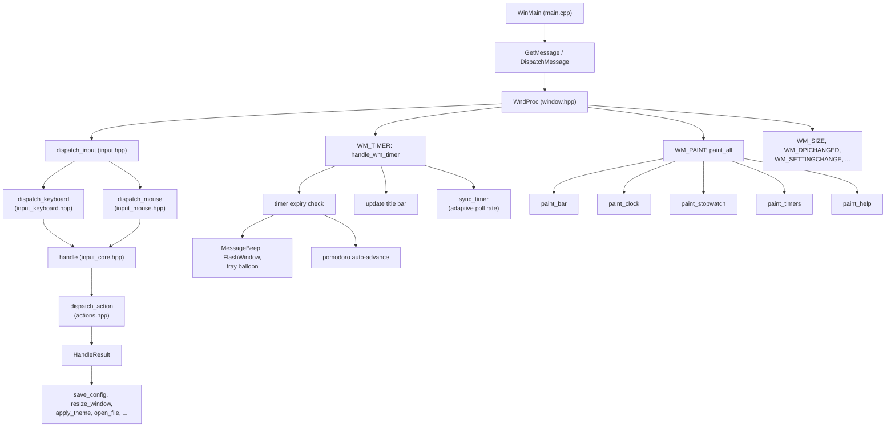
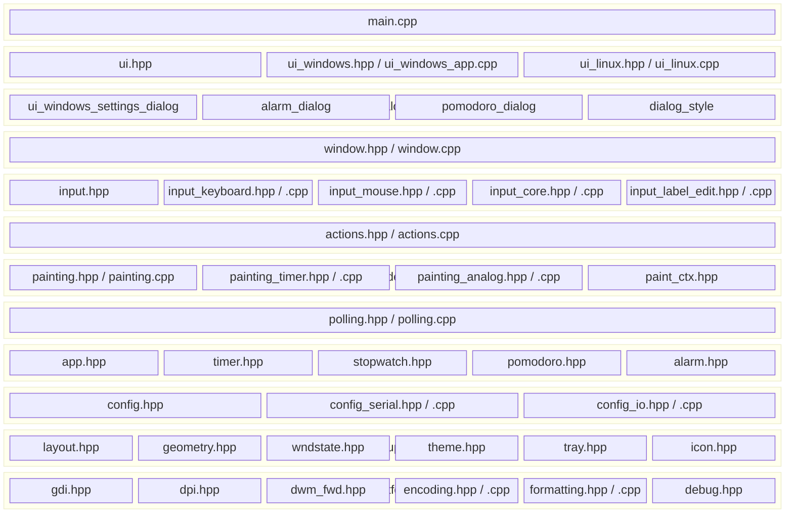

# Architecture

Chronos is a single-binary Win32 desktop app built with C++26 and raw GDI. The codebase is split across 20+ translation units with headers organized into clear layers.

## Message Flow

All user interaction flows through the Win32 message pump. Input messages are dispatched to action handlers that mutate state, and the result flags drive side effects (config save, window resize, theme change). Timer polling and painting follow separate paths.

## Module Layers

## Key Data Structures

**`App`** (`app.hpp`) -- Central application state. Holds the stopwatch, a vector of `TimerSlot`s (each pairing a `Timer` with its duration, label, notification flag, and pomodoro state), visibility toggles, and theme mode. This is the only mutable state that the action layer touches.

**`WndState`** (`wndstate.hpp`) -- Window-level state stored in `GWLP_USERDATA`. Owns `App`, the current `Layout`, the active `Theme`, all GDI resources (fonts, brushes, pens), the double-buffer DC, tray state, and the hit-test button list. Created in `WM_CREATE`, destroyed in `WM_DESTROY`.

**`Timer`** (`timer.hpp`) -- Countdown timer using `steady_clock`. Supports start, pause, reset, and restore (for session persistence). Tracks remaining time as `target - elapsed`, where elapsed accumulates across pause/resume cycles.

**`Config`** (`config.hpp`) -- Flat struct with INI serialization. Stores both settings (theme, visibility, window position) and runtime state (stopwatch elapsed, timer elapsed, pomodoro phase) so sessions survive restarts. Read/write uses `std::from_chars` parsing with no third-party dependency.

**`Layout`** (`layout.hpp`) -- DPI-scaled dimensions for every UI element. All sizes are defined as base constants at 96 DPI and scaled proportionally via `dpi_scale()`. Updated on `WM_DPICHANGED`.

## Design Decisions

**Multi-translation-unit build** -- Each logical module has a `.hpp` (declarations) and a `.cpp` (definitions), compiled in parallel. `main.cpp` is the entry point; platform-specific sources (`ui_windows_app.cpp`, `ui_linux.cpp`, dialogs) are gated by CMake platform conditions.

**No UI framework** -- Direct Win32 + GDI. The app is ~2800 lines total; a framework would add more complexity than it removes. GDI objects are managed with RAII wrappers (`GdiObj`, `DcObj`, `IconObj` in `gdi.hpp`).

**Atomic config save** -- `config_io.hpp` writes to a `.tmp` file then renames. This prevents corruption if the process is killed mid-write.

**Adaptive poll rate** -- `polling.hpp` adjusts `SetTimer` interval based on what's active: 20ms for a running stopwatch (smooth millisecond display), 100ms for countdown timers, 1000ms when idle.

**Pomodoro as a state machine** -- An 8-phase cycle (phases 0,2,4,6 = work; 1,3,5 = short break; 7 = long break). On timer expiry, `handle_wm_timer` auto-advances to the next phase, resets the timer, and starts it.

**Session restore via wall clock** -- When saving, the config records both elapsed time and the current wall-clock epoch. On reload, the delta between saved and current epoch is added to elapsed time, so timers and stopwatch continue accurately across restarts.

**Windows-only UI, portable logic** -- The window, rendering, and input layers depend on Win32 and GDI and only build on Windows. The data model, config serialization, Pomodoro state machine, and formatting utilities have no platform dependencies. CI compiles and runs the unit tests on Linux to keep the logic layer portable and independently verified.
